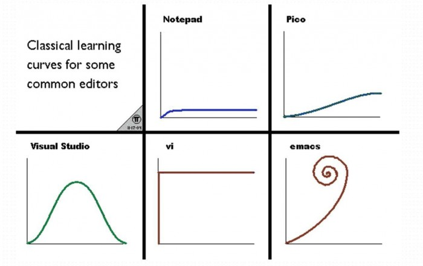
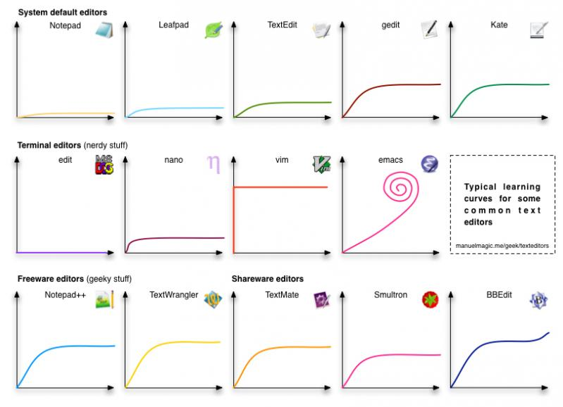

# 学习前端工具相关

---

### [Issue](https://github.com/roadToFront-end/front-end_base/issues/6)

### 版本控制
- [Git](https://git-scm.com/)

- [Github](https://github.com/)

- [Bitbucket](https://bitbucket.org/)

### Linux 系统相关

#### 终端推荐
- [Windows Terminal](https://github.com/microsoft/terminal)

- [iTerm2](https://iterm2.com/)

#### Linux 命令相关
- [Linux 命令大全搜索](https://wangchujiang.com/linux-command/) [备链-1](https://github.com/jaywcjlove/linux-command)

- [命令行的艺术](https://github.com/jlevy/the-art-of-command-line/blob/master/README-zh.md)

### Bash
- [bash 基本用法指南](https://github.com/vuuihc/bash-guide)

- [Bash 脚本教程](https://wangdoc.com/bash/intro.html)

### 编辑器
- [vscode（Visual Studio Code）](https://code.visualstudio.com/)

- [Visual Studio](https://visualstudio.microsoft.com/zh-hans/)， *Windows 下 [C++](https://docs.microsoft.com/en-us/cpp/) 开发首选推荐*

- [Atom](https://github.com/atom/atom)

- [Vim](https://www.vim.org/) [备链-1](https://github.com/vim/vim)

- [Emacs（GNU Emacs）](https://www.gnu.org/software/emacs/)

- [Sublime Text 4](https://www.sublimetext.com/blog/articles/sublime-text-4)，*付费软件*

#### 编辑器学习难度对比
- 一些编辑器的经典学习曲线 
</img>

- 几个文本编辑器的学习曲线 
</img>
